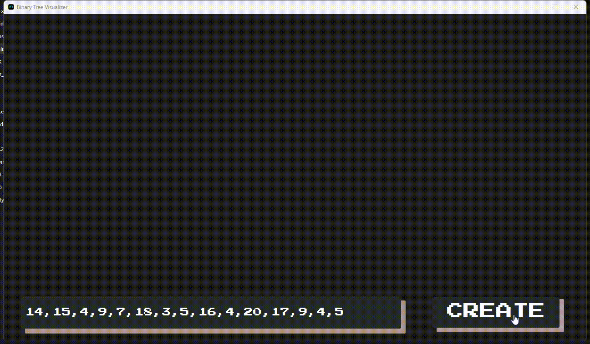

# Binary Tree Visualizer

**The Binary Tree Visualizer** is a JavaFX-based desktop application that helps users learn and explore binary trees through interactive visualizations. It brings algorithms to life by animating standard tree traversals, making data structure learning more intuitive and engaging.

## Overview

The **Binary Tree Visualizer** is a JavaFX application designed to help users understand and visualize binary trees in a dynamic, hands-on way. With this interactive tool, you can create binary trees, visualize their structure, and animate various traversal algorithms such as pre-order, in-order, post-order, and level-order. You can also input custom sequences to construct and explore personalized trees, making the app an excellent learning aid for both students and educators.



## Features

### 🌳 **Binary Tree Visualization**

* Automatically generate and display binary trees with graphical nodes and edges.
* Instantly see how different insertion orders affect tree structure.

### 🔄 **Animated Traversals**

* View step-by-step animations of core traversal algorithms:

  * **Pre-order**
  * **In-order**
  * **Post-order**
  * **Level-order**
* Great for reinforcing theoretical concepts with visual examples.

### 🛠 **Custom Input Support**

* Enter your own sequence of numbers (comma-separated) to create a custom tree.
* Intelligent insertion logic with basic handling for duplicates.

### 🎨 **User-Friendly Interface**

* Intuitive layout with clearly labeled buttons and inputs.
* Real-time rendering and animation feedback.

## Installation

### 🔧 Prerequisites

* **Java Development Kit (JDK)**: Latest version recommended (e.g., JDK 22).
* **JavaFX SDK**: Ensure JavaFX is properly downloaded and configured in your IDE.
* **Helpful Setup Guide**:
  🎥 [How To Setup JavaFX 22 and JDK 22 on NetBeans IDE (YouTube)](https://www.youtube.com/watch?v=G8seLHAYT6k)

### 📦 Setup Steps

1. Clone the repository:

   ```bash
   git clone https://github.com/AceBurgundy/JAVAFx-BinaryTree-Visualizer.git
   ```
2. Open the project in your preferred Java IDE (IntelliJ, NetBeans, Eclipse).
3. Ensure JavaFX libraries are correctly linked in your project settings.
4. Run the `App` class to launch the visualizer.

## Usage

1. **Launch the App**:

   * Execute the `App` class or use the `.exe` if on Windows.

2. **Generate a Tree**:

   * Use default or custom values to generate your binary tree.

3. **Custom Sequences**:

   * Input a comma-separated list of numbers and hit "Create" to build your own tree.

4. **Run Traversals**:

   * Select any traversal method (Preorder, Inorder, Postorder, Level-order).
   * Click "Create" to animate the traversal and observe the algorithm in action.

5. **Reset Functionality**:

   * Clear the tree with the "Reset" button and start a new session.

## Contribution

We welcome open-source contributions!

To contribute:

1. Fork the repository.
2. Create a feature branch:

   ```bash
   git checkout -b feature-yourFeatureName
   ```
3. Commit your changes:

   ```bash
   git commit -m "Describe your update"
   ```
4. Push to your forked repo:

   ```bash
   git push origin feature-yourFeatureName
   ```
5. Submit a pull request with a brief explanation.

## License

This project is licensed under the [Eclipse Public License - v 2.0](LICENSE).

## Contact

For support or collaboration inquiries:

* 📧 **Email**: [samadriansabalo99@gmail.com](mailto:samadriansabalo99@gmail.com)
* 💻 **GitHub**: [AceBurgundy](https://github.com/AceBurgundy)
